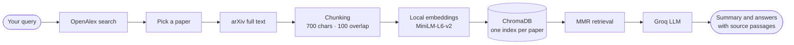

<div align="center">

<br/>

# ◈ R A B O T

### Read less. Understand more.

**Your research-paper companion. Find a paper, get a clear summary, and question it, with every answer grounded in the paper's own words.**

<br/>


<br/>

[Why RABOT](#-why-rabot) · [See it in action](#-see-it-in-action) · [Features](#-features) · [How it works](#-how-it-works) · [Quick start](#-quick-start) · [FAQ](#-faq)

<br/>

<!-- Add a screenshot here:   -->

</div>

---

## ✦ Why RABOT?

A research paper can hide the one answer you need on page nine. Skimming takes time, and a general chatbot may confidently invent what the paper "says".

**RABOT is built around one rule: the paper is the only source of truth.**

| Without RABOT | With RABOT |
|---|---|
| Hunt for the right paper across tabs | Search once and pick from ranked matches |
| Read 15 pages to find the method | A structured summary in seconds |
| Wonder whether an AI answer is real | Every answer shows the passages it came from |
| Re-process a paper you read last week | Reopen it instantly from saved data |

If the paper doesn't contain the answer, RABOT says **"This information is not available in the paper."** and doesn't guess.

---

## ✦ See it in action

```text
 ◈ RABOT                                  Search papers  ▸  attention is all you need

 ┌─────────────────────────────────────────────────────────────────────────────┐
 │  Attention Is All You Need                                                  │
 │  Vaswani · Shazeer · Parmar · Uszkoreit                                     │
 └─────────────────────────────────────────────────────────────────────────────┘
   [ 68 passages indexed ]   [ citations ]   [ questions asked ]

   Summary │ Ask the paper
   ───────────────────────
   Overview · Problem · Methodology · Key Contributions · Results · Limitations

 🧑‍🔬  Explain the methodology simply

 🤖  The methodology of the paper is to replace recurrent and convolutional
     models with a fully attention-based architecture called the Transformer...
       ▸ Source passages
```

**A typical session takes under a minute:**

1. **Search** a title or a few keywords.
2. **Open** the paper you want.
3. **Read** the structured summary.
4. **Ask** anything, from *"What datasets were used?"* to *"Explain the methodology simply."*

---

## ✦ Features

### 🔎 Find the right paper fast
Search open-access papers through OpenAlex. Results appear as cards with the year, authors and citation count, so you can pick with confidence.

### 🧾 Summaries that read like a tutor wrote them
Each summary covers **Overview, Problem, Methodology, Key Contributions, Results and Limitations**, then ends with an *In Simple Words* recap. Sections open with natural lead-ins such as *"The key contributions of this paper are…"*. The summary is built from seven targeted searches across the whole paper, so it doesn't rest on a single lucky passage.

### 💬 Answers you can verify
Ask in plain language and watch the answer stream in. Open **Source passages** under any answer to see the exact text it was drawn from.

### ⚡ Instant reopen
The vector index and the summary for each paper are saved to disk. Reopening a paper skips the download, the embedding and the summary generation.

### 🌑 A calm, focused interface
A custom **Obsidian & Amber** dark theme with warm gold accents and iris-violet glows. It has smooth card animations, a clean chat view, one-click suggested questions and a layout that adapts to smaller screens.

### 📤 Take your notes with you
Export the whole conversation as a Markdown file.

---

## ✦ Who it's for

- **Students** getting to grips with a paper before a seminar or exam
- **Researchers** triaging a reading list quickly
- **Engineers** checking a method or benchmark before implementing it
- **Curious readers** who want to understand a landmark paper without wading through jargon

---

## ✦ How it works



**Why you can trust the answers**

- **Retrieval first:** the model only sees passages pulled from the paper for your question.
- **Strict instructions:** the prompt forbids outside knowledge and requires the paper's own terminology.
- **Varied evidence:** MMR retrieval chooses passages that are relevant *and* different from each other, so answers draw on more of the paper.
- **Transparent sources:** the passages behind each answer are one click away.

---

## ✦ Tech stack

| Layer | Choice |
|---|---|
| Interface | Streamlit with custom CSS |
| Orchestration | LangChain |
| Language model | Groq · `openai/gpt-oss-120b` |
| Embeddings | Sentence Transformers `all-MiniLM-L6-v2`, run locally |
| Vector store | ChromaDB, persistent |
| Paper sources | OpenAlex API · arXiv |

---

## ✦ Quick start

**1 · Clone and install**

```bash
git clone https://github.com/AyazAhmad03/rabot.git
cd rabot
pip install -r requirements.txt
```

**2 · Add your keys** to a `.env` file in the project root:

```env
GROQ_API_KEY=your_groq_api_key
OPENALEX_API_KEY=your_openalex_api_key
```

> 🔒 Add `.env` to `.gitignore` so your keys never reach GitHub.

**3 · Launch**

```bash
streamlit run app.py
```

The app opens in your browser. Search for a paper from the sidebar to begin.

---

## ✦ Try these questions

| Understand | Dig deeper | Evaluate |
|---|---|---|
| What problem does this paper solve? | Explain the methodology simply. | What datasets were used? |
| What are the key contributions? | How does the model architecture work? | What are the main results? |
| Explain this paper to a beginner. | What do the authors compare against? | What are the limitations? |

---

## ✦ Project structure

```text
rabot/
├── app.py            # UI, retrieval pipeline and prompts
├── requirements.txt
├── .env              # API keys (not committed)
└── vector_store/     # Saved indexes and summaries, one set per paper
```

---

## ✦ FAQ

**Does RABOT use my own papers?**
Not yet. It loads open-access papers that are available on arXiv.

**Will it make things up?**
Like any AI system it can make mistakes, but it is designed to answer only from retrieved passages and to say so when the paper doesn't contain the answer. Check key findings against the original paper.

**Do I pay for embeddings?**
No. Embeddings run locally on your machine or server. The only API usage is the Groq model, once for the summary and once per question.

**Why did a paper fail to load?**
RABOT needs an arXiv version of the paper. If a result has none, try another result or a more exact title.

**Does it remember earlier questions?**
Each question is answered independently for now, so follow-ups work best when they're self-contained.

---

## ✦ Roadmap

- [ ] Conversational memory for follow-up questions
- [ ] Page-aware source citations
- [ ] Multi-paper comparison
- [ ] Export summaries to PDF
- [ ] A library of previously opened papers

---

## ✦ Author

Built by **Ayaz Ahmad** · [github.com/AyazAhmad03](https://github.com/AyazAhmad03)

If RABOT helps you read faster, a ⭐ on the repo is always appreciated.

---

<div align="center">
<sub>RABOT is made for education, research and portfolio use. Responses are generated by an AI model from retrieved paper text and may contain errors, so verify important findings in the original paper.</sub>
</div>
